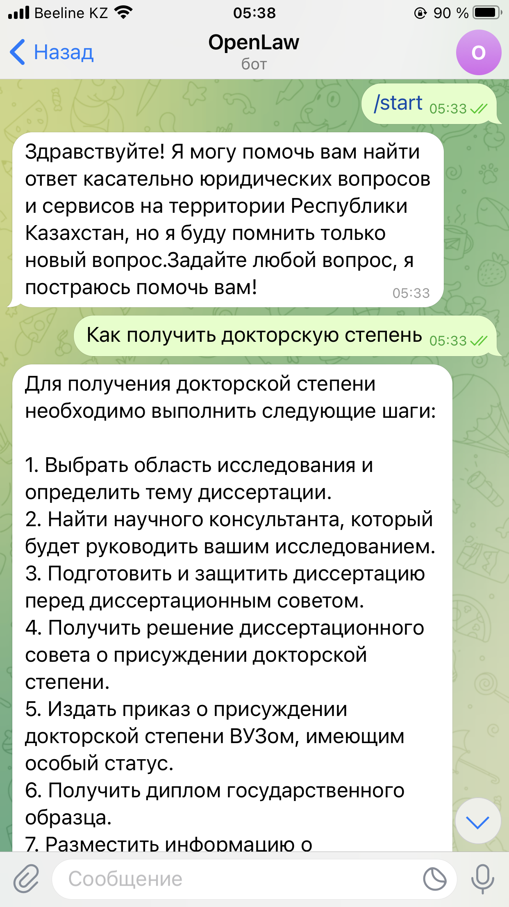
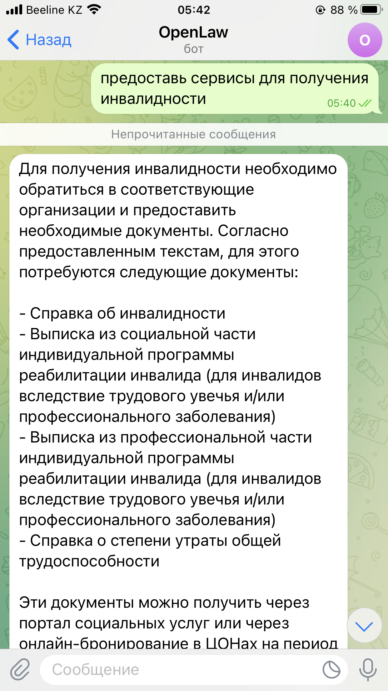
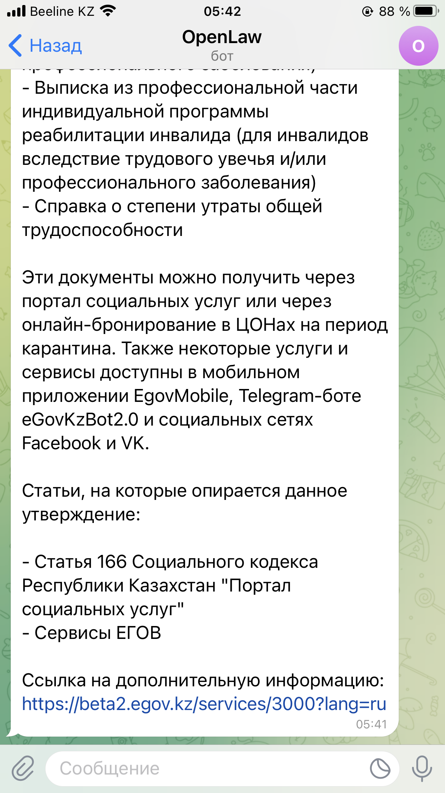

# OpenLaw
This is experiment of using RAG and LLM for answering questions related to laws of Kazakhstan.

  

  

  

You can use any model that understands russian language. Also, max_new_tokens and max_length must reduced to model requirements

This is initial step of project, and more steps will be done:
- [x] RAG + LLM development
- [x] Launching as telegram bot
- [ ] Kazakh language maintenance
- [ ] ......

### Code can be provided upon request: _dizdibay18@apec.edu.kz_
